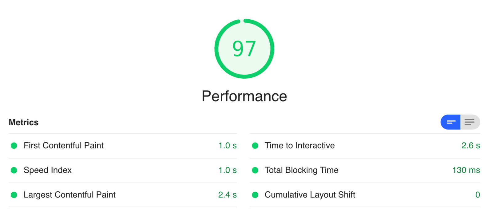
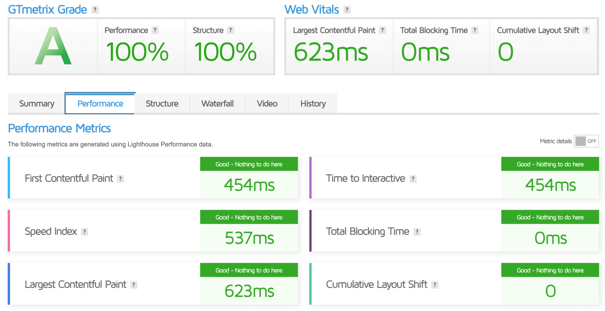

## Personal blog powered by Hugo

💰 **Zero-cost** (but it still takes your time, though) hosting and CI/CD with GitHub and free CloudFlare CDN for the fast content delivery and better compression.

👨‍💻 Static website generator — [Hugo](https://gohugo.io/)

📝 Blog theme: [PaperMod](https://github.com/adityatelange/hugo-PaperMod/) used as Git submodule

⚙️ CI/CD: GitHub [Actions](https://docs.github.com/en/actions) (see my [workflow](./.github/workflows/website.yaml) for example)

🌎 Free account at [CloudFlare](https://www.cloudflare.com/plans/) for CDN 

### Hugo and PaperMod theme customization:

- [attention](./layouts/shortcodes/attention.html) and [updatenotice](./layouts/shortcodes/updatenotice.html) — colored blocks used to inform about the important changes in a publication

    example of `attention`: https://serhii.vasylenko.info/2021/05/21/configure-http-security-headers-with-cloudfront-functions.html

    example of `updatenotice`: https://serhii.vasylenko.info/2021/01/20/terraforming-mac1-metal-at-AWS.html

- [snippet](./layouts/shortcodes/snippet.html) — collapsible block of text (aka spoiler), useful for code snippets

## Performance Reports
### Lighthouse

### GTmetrix 
