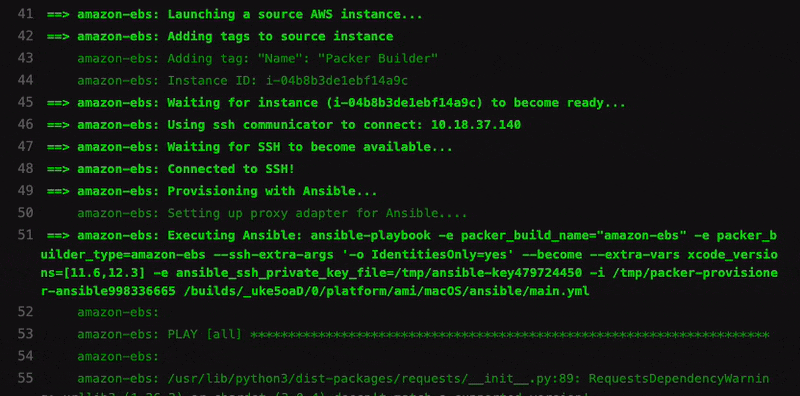

I guess macOS was designed for a user, not for the ops or engineers, so this is why its customization and usage for CI/CD are not trivial (compared to something Linux-based). A smart guess, huh?

# Configuration Management
Native Apple's Mobile device management (a.k.a MDM) and Jamf is probably the most potent combination for macOS configuration. But as much as it's mighty, it is a cumbersome combination, and Jamf is not free.

Then we have Ansible, Chef, Puppet, SaltStack — they all are good with Linux, but what about macOS?

I tried to search for use cases of mentioned CM tools for macOS. However, I concluded that they wrap the execution of native macOS command-line utilities most of the time.

And if you search for the 'macos' word in Chef Supermarket or Puppet Forge, you won't be impressed by the number of actively maintained packages. Although, here is a motivating article about using Chef [automating-macos-provisioning-with-chef](https://pspdfkit.com/blog/2016/chef-on-macos/) if you prefer it. I could not find something similar and fresh for Puppet, so I am sorry, Puppet fans.

That is why I decided to follow the KISS principle and chose Ansible.

It's easy to write and read the configuration, it allows to group tasks and to add execution logic ~~, and it feels more DevOps executing shell commands inside Ansible tasks instead of shell scripts; I know you know that 😂~~

By the way, Ansible Galaxy does not have many management packages for macOS, either. But thankfully, it has the basics:
- [homebrew](https://docs.ansible.com/ansible/latest/collections/community/general/homebrew_module.html#ansible-collections-community-general-homebrew-module) with [homebrew_cask](https://docs.ansible.com/ansible/latest/collections/community/general/homebrew_cask_module.html#ansible-collections-community-general-homebrew-cask-module) and [homebrew_tap](https://docs.ansible.com/ansible/latest/collections/community/general/homebrew_tap_module.html#ansible-collections-community-general-homebrew-tap-module) — to install software
- [launchd](https://docs.ansible.com/ansible/latest/collections/community/general/launchd_module.html#ansible-collections-community-general-launchd-module) — to manage services
- [osx_defaults](https://docs.ansible.com/ansible/latest/collections/community/general/osx_defaults_module.html#ansible-collections-community-general-osx-defaults-module) — to manage some user settings (not all!)

I used Ansible to build the macOS AMI for CI/CD, so here are some tips for such a case.

_Some values are hardcoded intentionally in the code examples for the sake of simplicity and easy reading. You would probably want to parametrize them._

## Xcode installation example
The following tasks will help you to automate the basics.

```yaml
- name: Install Xcode
      shell: "xip --expand Xcode.xip"
      args:
        chdir: /Applications

- name: Accept License Agreement
  shell: "/Applications/Xcode.app/Contents/Developer/usr/bin/xcodebuild -license accept"

- name: Accept License Agreement
  shell: "/Applications/Xcode.app/Contents/Developer/usr/bin/xcodebuild -runFirstLaunch"

- name: Switch into newly installed Xcode context
  shell: "xcode-select --switch /Applications/Xcode.app/Contents/Developer"
```

## Example of software installation with Brew

```yaml
- name: Install common build software
  community.general.homebrew:
    name: "{{ item }}"
    state: latest
  loop:
    - swiftlint
    - swiftformat
    - wget
```


## ScreenSharing (remote desktop) configuration example
```yaml
- name: Turn On Remote Management
  shell: "./kickstart -activate -configure -allowAccessFor -specifiedUsers"
  args:
    chdir: /System/Library/CoreServices/RemoteManagement/ARDAgent.app/Contents/Resources/

- name: Enable Remote Management for CI user
  shell: "./kickstart -configure -users ec2-user -access -on -privs -all"
  args:
    chdir: /System/Library/CoreServices/RemoteManagement/ARDAgent.app/Contents/Resources/
```
Shell rulez, yes.

# Building the AMI


[Packer by HashiCorp](https://www.packer.io/docs/builders/amazon/ebs), of course.

I would love to compare Packer with EC2 Image Builder, but it [does not support macOS](https://docs.aws.amazon.com/imagebuilder/latest/userguide/what-is-image-builder.html#image-builder-os) yet (as of Feb'21).

Packer configuration is straightforward, so I want to highlight only the things specific to the "mac1.metal" use case.

## Timeouts
As I mentioned in the [previous article](https://serhii.vasylenko.info/2021/01/19/mac1-metal-EC2-Instance-user-experience.html), the creation and deletion time of the "mac1.metal" Instance is significantly bigger than Linux. That is why you should raise the polling parameters for the builder.

Example:
```json
"aws_polling": {
        "delay_seconds": 30,
        "max_attempts": 60
}
```

And it would be best if you also increased the SSH timeout:
```json
  "ssh_timeout": "1h"
```

Fortunately, Packer's AMI builder does not require an explicit declaration of the Dedicated Host ID. So you can just reference the same subnet where you allocated the Host, assuming you did it with the enabled "Auto placement" parameter during the host creation.

Example:
```json
  "tenancy": "host",
  "subnet_id": "your-subnet-id"
```

## Provisioning
Packer has [Ansible Provisioner](https://www.packer.io/docs/provisioners/ansible) that I used for the AMI. Its documentation is also very clean and straightforward.

But it is still worth mentioning that if you want to parametrize the Ansible playbook, then the following configuration example will be handy:

```json
  "extra_arguments": [
    "--extra-vars",
    "your-variable-foo=your-value-bar]"
  ],
  "ansible_env_vars": [
    "ANSIBLE_PYTHON_INTERPRETER=auto_legacy_silent",
    "ANSIBLE_OTHER_ENV_VARIABLE=other_value"
  ]
```

# Configuration at launch
If you're familiar with AWS EC2, you probably know what the Instance `user data` is.

A group of AWS developers made something similar for the macOS: [EC2 macOS Init](https://github.com/aws/ec2-macos-init).

It does not support `cloud-init` as on Linux-based Instances, but it can run shell scripts, which is quite enough.

EC2 macOS Init utility is a Launch Daemon (macOS terminology) that runs on behalf of the `root` user at system boot. It executes the commands according to the so-called Priority Groups, or the sequence in other words.

The number of the group corresponds to the execution order. You can put several tasks into a single Priority Group, and the tool will execute them simultaneously.

EC2 macOS Init uses a human-readable configuration file in `toml` format.

Example:

```
[[Module]]
  Name = "Create-some-folder"
  PriorityGroup = 3
  FatalOnError = false 
  RunPerInstance = true 
  [Module.Command]
    Cmd = ["mkdir", "/Users/ec2-user/my-directory"] 
    RunAsUser = "ec2-user"
    EnvironmentVars = ["MY_VAR_FOO=myValueBar"]
```

I should clarify some things here.

Modules — a set of pre-defined modules for different purposes. It is something similar to the Ansible modules.

You can find the list of available modules here [ec2-macos-init/lib/ec2macosinit](https://github.com/aws/ec2-macos-init/tree/master/lib/ec2macosinit)

The `RunPerInstance` directive controls whether a module should run. There are three of such directives, and here is what they mean:

- `RunPerBoot` — module will run at every system boot
- `RunPerInstance` — module will run once for the Instance. Each Instance has a unique ID; the init tool fetches it from the AWS API before the execution and keeps its execution history per Instance ID. When you create a new Instance from the AMI, it will have a unique ID, and the module will run again.
- `RunOnce` — module will run only once, despite the instance ID change

I mentioned the execution history above. When EC2 macOS Init runs on the Instance first time, it creates a unique directory with the name per Instance ID to store the execution history and user data copy.

`RunPerInstance` and `RunOnce` directives depend on the execution history, and modules with those directives will run again on the next boot if the previous execution failed. It was not obvious to me why RunOnce keeps repeating itself every boot until I dug into [the source code](https://github.com/aws/ec2-macos-init/blob/master/lib/ec2macosinit/module.go#L110).

Finally, there is a module for user data. It runs at the end by default (priority group #4) and pulls the user data script from AWS API before script execution.

I suggest looking into the default [init.toml](https://github.com/aws/ec2-macos-init/blob/master/configuration/init.toml) configuration file to get yourself more familiar with the capabilities of the tool.

The init tool can also clear its history, which is useful for the new AMI creation.

Example:
```shell
ec2-macos-init clean -all
```

And you can run the init manually for debugging purposes.

Example:

```shell
ec2-macos-init run
```

You can also combine the EC2 macOS Init actions (made by modules) with your script in user data for more accurate nontrivial configurations.

# Wrapping up
As a whole, building and operating macOS-based AMI does not differ from AMI management for other platforms.

There are the same principle stages: prepare, clear, build, execute deployment script (if necessary). Though, the particular implementation of each step has its nuances and constraints.

So the whole process may look as follows:
- Provision and configure needed software with Ansible playbook
- Clean-up system logs and EC2 macOS Init history (again, with Ansible task)
- Create the AMI
- Add more customizations at launch with EC2 macOS Init modules and user data (that also executes your Ansible playbook or shell commands)

Getting into all this was both fun and interesting. Sometimes painful, though. 😆

I sincerely hope this article was helpful to you. Thank you for reading!