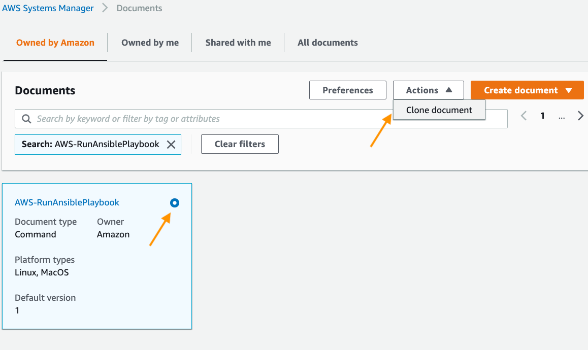

In days of containers and serverless applications, Ansible looks not such a trendy thing.

But still, there are cases when it helps, and there are cases when it combines very well with brand new product offerings, such as EC2 Mac instances.

The [more I use mac1.metal](https://serhii.vasylenko.info/2021/02/01/customizing-mac1-metal-ec2-ami.html) in AWS, the more I see that Ansible becomes a bedrock of software customization in my case.

And when you have a large instances fleet, the AWS Systems Manager becomes your best friend (the sooner you get along together, the better).

So is it possible to use Ansible playbooks for mac1.metal on a big scale, with the help of AWS Systems Manager?

## (Not) Available out of the box
AWS Systems Manager (SSM hereafter) has a pre-defined, shared Document that allows running Ansible playbooks.

It’s called “AWS-RunAnsiblePlaybook,” and you can find it in AWS SSM → Documents → Owned by Amazon.

However, this Document is not quite “friendly” to macOS. When the SSM agent calls Ansible on the Mac EC2 instance, it does not recognize the Ansible installed with Homebrew (de-facto most used macOS package manager).

So if you try to run a command on the mac1.metal instance using this Document, you will get the following error:


```shell
Ansible is not installed. Please install Ansible and rerun the command.
```

The root cause is trivial: the path to Ansible binary is not present on the list of paths available to the SSM agent by default.

There are several ways to solve that, but I believe that the most convenient one would be to create your custom Document — a slightly adjusted version of the default one provided by AWS.

## Creating own SSM Document for Ansible installed with Homebrew

All you need to do is clone the Document provided by AWS and change its code a little — replace the callouts of `ansible` with the full path to the binary.

Navigate to AWS SSM → Documents → Owned by Amazon and type `AWS-RunAnsiblePlaybook` in the search field.

Select the Document by pressing the circle on its top-right corner and then click Actions → Clone document.



Give the new SSM Document a name, e.g., `macos-arbitrary-ansible-playbook`, and change the `ansible` callouts (at the end of the code) with the full path to the ansible symlink made by Homebrew which is `/usr/local/bin/ansible`

Here is the complete source code of the Document with adjusted Ansible path:


```json
{
  "schemaVersion": "2.0",
  "description": "Use this document to run arbitrary Ansible playbooks on macOS EC2 instances. Specify either YAML text or URL. If you specify both, the URL parameter will be used. Use the extravar parameter to send runtime variables to the Ansible execution. Use the check parameter to perform a dry run of the Ansible execution. The output of the dry run shows the changes that will be made when the playbook is executed.",
  "parameters": {
    "playbook": {
      "type": "String",
      "description": "(Optional) If you don't specify a URL, then you must specify playbook YAML in this field.",
      "default": "",
      "displayType": "textarea"
    },
    "playbookurl": {
      "type": "String",
      "description": "(Optional) If you don't specify playbook YAML, then you must specify a URL where the playbook is stored. You can specify the URL in the following formats: http://example.com/playbook.yml  or s3://examplebucket/plabook.url. For security reasons, you can't specify a URL with quotes.",
      "default": "",
      "allowedPattern": "^\\s*$|^(http|https|s3)://[^']*$"
    },
    "extravars": {
      "type": "String",
      "description": "(Optional) Additional variables to pass to Ansible at runtime. Enter a space separated list of key/value pairs. For example: color=red or fruits=[apples,pears]",
      "default": "foo=bar",
      "displayType": "textarea",
      "allowedPattern": "^((^|\\s)\\w+=(\\S+|'.*'))*$"
    },
    "check": {
      "type": "String",
      "description": " (Optional) Use the check parameter to perform a dry run of the Ansible execution.",
      "allowedValues": [
        "True",
        "False"
      ],
      "default": "False"
    },
    "timeoutSeconds": {
      "type": "String",
      "description": "(Optional) The time in seconds for a command to be completed before it is considered to have failed.",
      "default": "3600"
    }
  },
  "mainSteps": [
    {
      "action": "aws:runShellScript",
      "name": "runShellScript",
      "inputs": {
        "timeoutSeconds": "{{ timeoutSeconds }}",
        "runCommand": [
          "#!/bin/bash",
          "/usr/local/bin/ansible --version",
          "if [ $? -ne 0 ]; then",
          " echo \"Ansible is not installed. Please install Ansible and rerun the command\" >&2",
          " exit 1",
          "fi",
          "execdir=$(dirname $0)",
          "cd $execdir",
          "if [ -z '{{playbook}}' ] ; then",
          " if [[ \"{{playbookurl}}\" == http* ]]; then",
          "   wget '{{playbookurl}}' -O playbook.yml",
          "   if [ $? -ne 0 ]; then",
          "       echo \"There was a problem downloading the playbook. Make sure the URL is correct and that the playbook exists.\" >&2",
          "       exit 1",
          "   fi",
          " elif [[ \"{{playbookurl}}\" == s3* ]] ; then",
          "   aws --version",
          "   if [ $? -ne 0 ]; then",
          "       echo \"The AWS CLI is not installed. The CLI is required to process Amazon S3 URLs. Install the AWS CLI and run the command again.\" >&2",
          "       exit 1",
          "   fi",
          "   aws s3 cp '{{playbookurl}}' playbook.yml",
          "   if [ $? -ne 0 ]; then",
          "       echo \"Error while downloading the document from S3\" >&2",
          "       exit 1",
          "   fi",
          " else",
          "   echo \"The playbook URL is not valid. Verify the URL and try again.\"",
          " fi",
          "else",
          " echo '{{playbook}}' > playbook.yml",
          "fi",
          "if  [[ \"{{check}}\" == True ]] ; then",
          "   /usr/local/bin/ansible-playbook -i \"localhost,\" --check -c local -e \"{{extravars}}\" playbook.yml",
          "else",
          "   /usr/local/bin/ansible-playbook -i \"localhost,\" -c local -e \"{{extravars}}\" playbook.yml",
          "fi"
        ]
      }
    }
  ]
}
```



## Applying Ansible playbook to the fleet of mac1.metal

Let’s give our new SSM Document a try! (I suppose you have at least one mac1 instance running, right?)

In AWS SSM, go to the Run Command feature, then click on the Run Command button.

On the new panel, type the name of your Document (`macos-arbitrary-ansible-playbook` in this example) in the search field and press enter.

Select the Document, and you’ll see its parameters and settings.

The rest is self-explanatory. Enter either a playbook code or a link to the source file, add extra variables if needed, and select the target host or a filtered bunch (I like that feature with tags filtering!). Finally, click on the “Run” orange button to apply your playbook.

That’s it! Now you can make all your ansible-playbook dreams come true! 😁