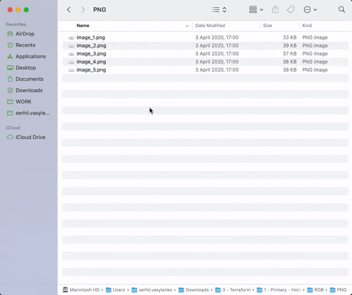
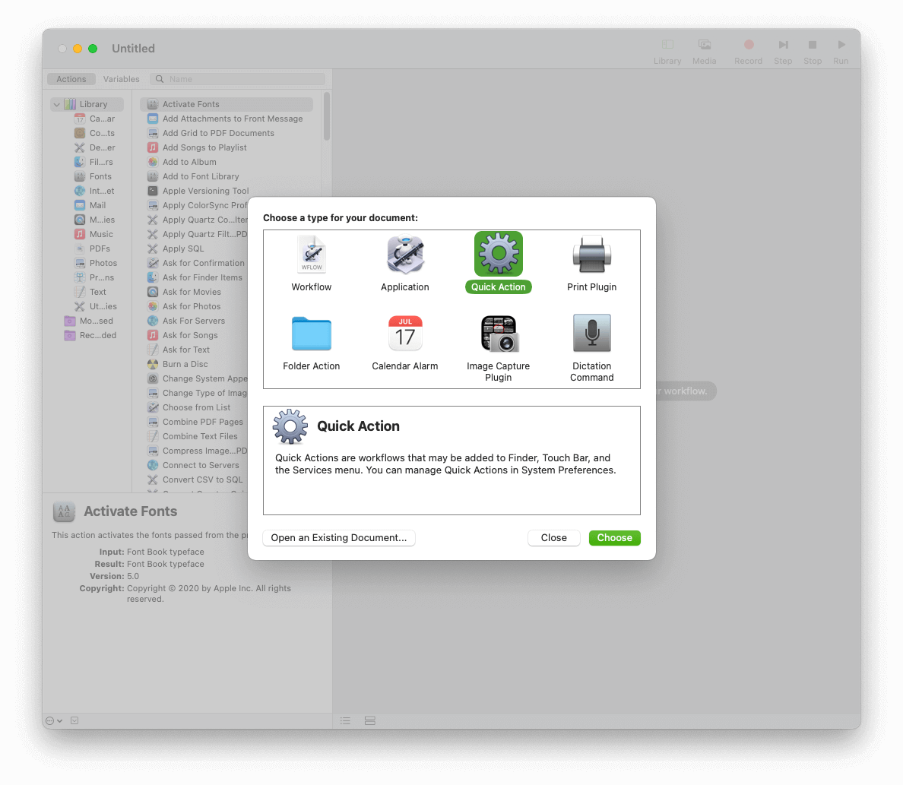
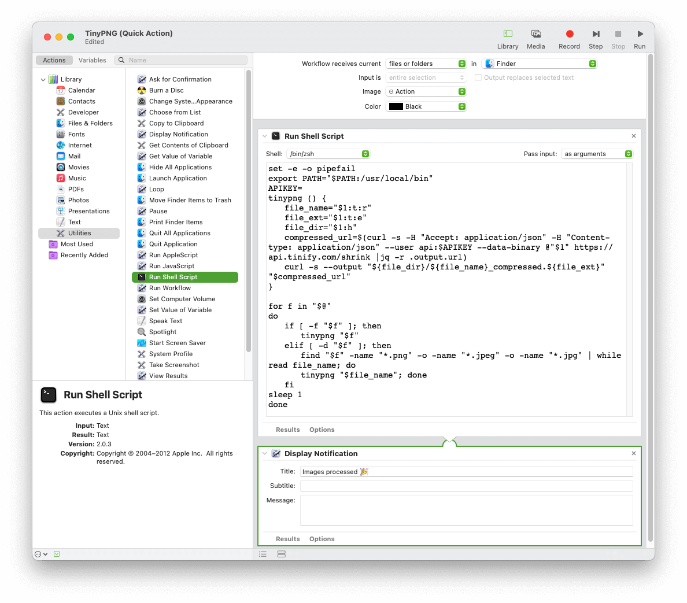

I just wanted to compress one image, but went to far...

or "How to add TinyPNG image compression to your macOS Finder contextual menu."

# What is it and how it works
You select needed files or folders, then right-click on them, click on the Services menu item and choose TinyPNG.

After a moment, the new optimized versions of images will appear near to original files.

If you selected a folder along with the files, the script would process all `png` and `jpeg` files in it.

# Prerequisites
You need to register at TinyPNG and get your API key here — [Developer API](https://tinypng.com/developers).

They sometimes block some countries (for example, Ukraine) from registration; in that case, try to use a web-proxy or VPN.

# How to create Quick Action Workflow
Open Automator application. If you never used this app before, please read about it on the official [user guide website](https://support.apple.com/guide/automator/create-a-workflow-aut7cac58839/2.10/mac/11.0).

On the New Action screen, chose **Quick Action**

After you click the "Choose" button, you'll see the workflow configuration window.

# Workflow configuration
Find the **Run Shell Script** action on the Utilities list in Library on the left, and drag it onto the right side of the panel.

Set the following workflow configuration options as described below:

**Workflow receives current** `files and folders` **in** `Finder`

**Shell** `/bin/zsh`

**Pass input** `as arguments`

Click the **Option** button at the bottom of the Action window and **Uncheck** `Show this action when the workflow runs.`

Put the following script into the **Run Shell Script** window, replacing the *YOUR_API_KEY_HERE* string with your API key obtained from TinyPNG.



## Utilities used in the script — explained

`curl` — used to make web requests (like your browser does)

`grep` — used to parse the response for the needed header (i.e., field) with the file download link

`cut` — used to extract the URL from the parsed result

`sed` — used to remove the trailing "carriage return" symbol at the end of extracted string

The response body also contains a JSON object that includes the download URL; you can parse it with `jq`, for example. But I intentionally refused to use the `jq` tool because it is not pre-installed in MacOS.

# Conclusion

It is simple, and it does its job fine. And you don't need to install anything to make it work.

To make this a bit fancier, you might also like to add a "Display Notification" (from the Utilities library on the left) after the "Run Shell Script". The action will display a notification once image processing is completed.

Thank you for reading!