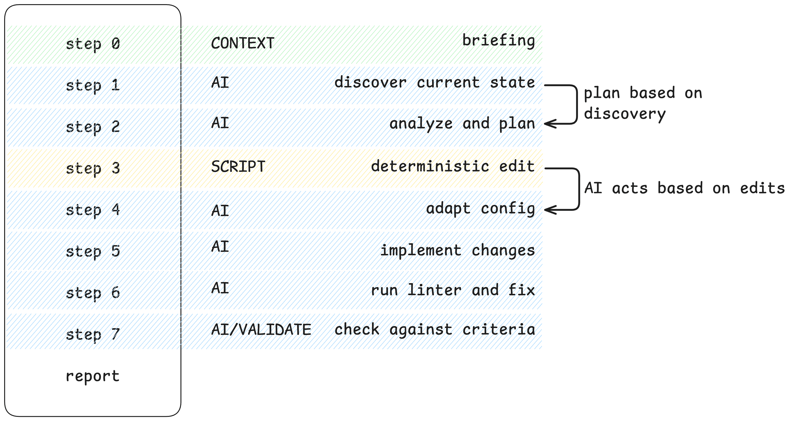
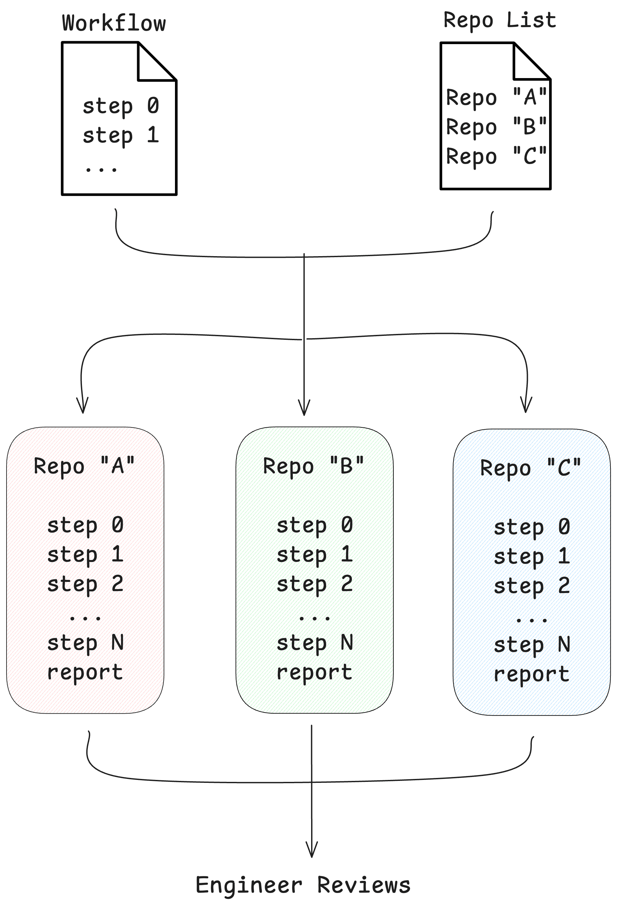

*A continuation of [Flip the Axis: A Layer-Based Approach to Multi-Service Migrations](https://devdosvid.blog/2026/03/05/flip-the-axis-a-layer-based-approach-to-multi-service-migrations/).*

## TL;DR

You can't script your way across a fleet of snowflake repositories. Neither can you just ask an AI agent to "migrate this service" and hope. What worked for the eight-quarter migration was a harness -- a prompt pipeline in which each layer was a sequence of ordered steps: some calling scripts for deterministic changes, some using AI to discover and adapt, and some validating the results. The harness chained their outputs, ran each layer across 21 repos at once, and landed merge requests when it was done.

Here's what that looked like in practice -- including the parts we got wrong.

## From methodology to machinery

The previous article ended on a line worth repeating: *the methodology enables the tooling, not the other way around*. This post is where that line becomes machinery.

The project: migrating 21 services from ECS to EKS -- the final wave of an eight-quarter effort. Four engineers, targeting roughly ten repos per engineer per day on a given layer. The services were snowflakes: each with its own code style, CI configuration, logging framework, naming conventions, and infrastructure setup. The layers defined *what* to do -- add an OIDC provider, swap the logging appender, rewrite the CI pipeline, set up a piece of infra -- and the action was identical across services. But *how* to execute each layer varied across repositories. Same change, different wiring, 21 times over -- toil that doesn't yield to a single script. The layer approach made that pace imaginable. The harness made it real -- though the most important piece wasn't what we built first.

## How a layer runs

Every layer ran through the same pipeline -- a workflow of ordered prompts that mixed step types.

Take logging. One service uses `logback.xml` and is Java, another uses a custom logging setup and is NodeJS, and another has a custom appender in a shared library. You can't script that discovery -- but you *can* script adding the dependency once the agent finds the right config. So the workflow does both: an AI step to discover and adapt, a script step for the deterministic edit, and a validation step to check the result.

Some steps called Go tools for deterministic changes -- known target, computable edit, no reasoning required. Others used AI to discover and adapt: Terraform is a good example -- we could not realistically script the changes, but we could give the LLM the modules to use for adding new configuration. Others validated what the earlier ones produced. The pipeline chained their outputs, for example:

- What a script produced in step 3 informed what the agent analyzed in step 4.
- What the agent implemented in step 5 was what the validation prompt checked in step 7.

## Why "ask Claude to migrate this service" fails

You cannot ask an AI agent to "migrate this service to EKS." The task is too broad. The context is too large. The agent will hallucinate a plausible-looking solution, skip steps it decided weren't important, or produce something that *looks* right and isn't.

> [!NOTE]
The failure mode isn't that the AI is dumb. It's that the task has no structure, so the agent invents its own -- and its structure drifts between runs.

You get 21 repositories migrated in 21 different ways, with 21 different sets of mistakes to audit. That's worse than having done nothing.

The fix isn't a better prompt. The fix is everything *around* the prompt.

## Harness engineering, named a little late

A few months ago, the term *harness engineering* started showing up -- a zero-volume search term until early 2026. The idea: design the constraints and scaffolding around an LLM that make it reliable. Not whether to use AI, but to answer: what do you do *after* it's part of your toolchain?

So far, the conversation is mostly about coding agents. We got here through infrastructure migration -- and structured infra work is where the pattern fits most naturally. The changes follow patterns. The validation criteria are concrete. And the same change repeats across dozens of repos -- which is exactly what a harness is built for.

The answer turns out to be unsexy: a pipeline that runs prompts in a fixed order, enforces what the agent can touch at each step, and validates its own work before declaring done.

I didn't have that term in October 2025 when we built our own version of one. It's easier to name a thing after you've already built it wrong twice. We just kept running into the same failure -- the agent doing too much, too fast, with not enough guardrails -- and kept adding constraints until it stopped failing. Mutation boundaries. Ordered steps. Explicit reasoning gates. Validation passes.

What was new -- for us -- was treating the harness as the *primary engineering artifact*. Not the prompt. Not the model. The pipeline around them.

The shift worth taking from it is this -- stop optimizing the prompt, start engineering the pipeline that runs it.



## What our harness looked like

A workflow is a sequence of numbered markdown files -- each one a step prompt. The agent runs them in order inside an isolated Claude Code session. Context compounds: what step 2 discovered informs what step 5 decides.

The shape is always the same: context → discovery → analysis → planning → implementation → validation → ship → report.

Not every step needs the agent to reason. Some prompts call a Go tool or script for a deterministic change -- same edit, known target, no drift. Others need AI to discover, analyze, and adapt. The workflow mixes both and outputs the chain forward.

Six things make this structure trustworthy:

- **Mutation boundaries.** Every step is tagged `READ ONLY`, `MAKES CHANGES`, or `PLANNING ONLY`. The agent knows what it's allowed to do at each point. No surprise writes during discovery.

- **Context anchoring.** Step 0 explains *why*, not just *what*. "Here is why we move this piece of infrastructure and need it to be X and Z in a new destination." "Here is why templates can't be applied blindly." The agent gets the intent before it touches any code.

- **Domain knowledge in the prompts.** Hard-won lessons encoded directly: *"BOM manages versions -- you still must declare STS explicitly."* *"Check actual pipeline behavior, not just config files."* These are the footnotes a senior engineer would leave for a junior one. The agent gets them every time.

The first three give the agent the right starting position. The rest keep it from wandering.

- **Early exits.** If the dependency already exists, skip to the report. If a values file for a Helm chart is already configured, skip to the report. Not every repo needs every step.

- **Explicit reasoning gates.** Complex steps require reasoning, so the agent has to reason through the problem before acting -- no freestyle implementation -- and this must be declared explicitly.

- **The implement/validate split.** For critical layers, two separate workflows ran in sequence: one to implement, one to validate. The validation workflow reviewed the implementation against defined criteria rather than rubber-stamping its own work. This did more for reliability than any other constraint we added.

None of these is about making the agent smarter. They're about making it *predictable*. Every constraint trades a degree of freedom for a degree of reliability. That's the whole game.

## The instrument

Workflows describe *what* the agent should do per repo. We still needed an orchestrator to run them -- and to run them across a batch of repos at once.

So we built a parallel execution wrapper on top of the Claude Agent SDK. Think of it as a prompt pipeline runner. Point it at a workflow and a list of repositories, and for each repo it clones into its own git worktree, spins up an isolated Claude Code session, runs the workflow's step files in order, enforces the mutation boundaries from the previous section, and lands a per-repo report when it's done. One engineer monitors the batch and reviews the results.

Each session adapts to its repository while following the same workflow. The agent in repo A figures out one logging setup; the agent in repo B figures out a completely different one. Both produce the same kind of report. The engineer opens ten reports instead of writing ten PRs.

This is the automated [flip-the-axis](https://devdosvid.blog/2026/03/05/flip-the-axis-a-layer-based-approach-to-multi-service-migrations/) model. One layer, one workflow, N repos, one human in the loop. All twelve migration layers ran through this pipeline.

Prompt pipeline + parallel sessions + per-repo reports + human review at the end.

## Prompts as production code

The non-obvious part: all of this lived in a shared repository. Workflows, runbooks, Go tools, scripts, per-service metadata -- all version-controlled in one place. The project headquarters.

This wasn't convenient. It was a knowledge-sharing mechanism.

When an engineer discovered a prompt needed more specificity -- say, the IAM workflow missed an edge case with cross-account trust policies -- they updated the prompt and committed it. On the next pull, every teammate got the improvement. Same for validation scripts, runbook instructions, and service metadata.

**The lesson:** treat AI prompts and workflows like production code. Review changes. Iterate as a team. The prompts you write in week 1 will not be the prompts you need in week 6 -- and every improvement should propagate to everyone automatically.

If your team is adopting AI for infra work and the prompts live in private gists, you've already lost the compounding advantage.

## Honest assessment

**Cross-referencing was the hardest problem we didn't fully solve.** The Helm values layer required correlating data from Terraform configs, ECS task definitions, and application codebases into a single file. AI agents working within a single repository can't hold that full picture. Human judgment and manual cross-checking stayed essential here, and I don't think that's going to change for this class of problem anytime soon.

**The reliability gradient was predictable.** Within each workflow, the deterministic steps -- the ones calling scripts -- never drifted. The AI steps were reliable when isolated to a single file following a repeatable pattern. Reliability dropped when a step required cross-repository context or judgment calls about tradeoffs. Those stayed with humans.

**We validated -- but not enough.** The implement/validate split worked wherever we applied it -- it was the highest-leverage pattern in the whole setup. But we didn't apply it to every layer, and we should have. The same workflows we used for implementation could have run in verification mode at near-zero additional cost. Our QA and PREPROD environments caught what universal validation would have. They shouldn't have had to.

If I were starting this project again tomorrow, the first thing I'd build is a validation workflow for every implementation workflow, from day one. Not as an afterthought. As a matching pair.

## What this means

Layers made the work universal. Harnesses made the AI trustworthy enough to run it -- even across 21 repos, each wired differently. Together they closed out an eight-quarter migration -- four engineers, not forty.

The next time someone frames it as "just write a script" versus "just use AI" -- it's the wrong question. Build the harness that runs both.

---

**Further reading:**

- [Harness Design for Long-Running Application Development](https://www.anthropic.com/engineering/harness-design-long-running-apps) -- Anthropic's engineering team on the same concept applied to agentic coding.
- [Harness Engineering](https://openai.com/index/harness-engineering/) -- OpenAI's take on the same discipline.
- [It's a Skill Issue: Harness Engineering for Coding Agents](https://www.humanlayer.dev/blog/skill-issue-harness-engineering-for-coding-agents) -- HumanLayer on harness configuration for coding agents.
