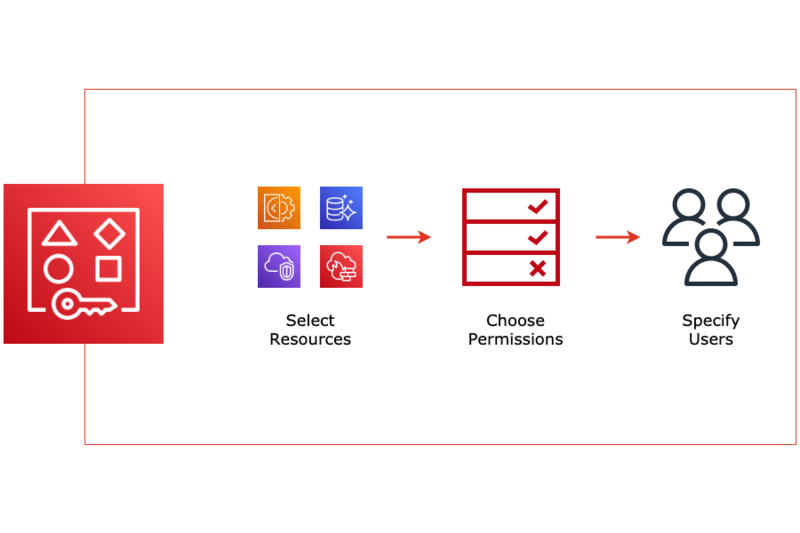

With a multi-account approach of building the infrastructure, there is always a challenge of provision and governance of the resources to subordinate accounts within the Organization. Provision resources, keep them up to date, and decommission them properly — that's only a part of them.

AWS has numerous solutions that help make this process reliable and secure, and the Resource Access Manager (RAM) is one of them.
In a nutshell, the RAM service allows you to share the AWS resources you create in one AWS account with other AWS accounts. They can be your organizations' accounts, organizational units (OU), or even third-party accounts.

So let's see what the RAM is and review some of its usage examples. 

## Why using RAM
There are several benefits of using the RAM service:
1. **Reduced operational overhead**: eliminate the need of provisioning the same kind of resource multiple times — RAM does that for you

2. **Simplified security management**: AWS RAM-managed permissions (at least one per resource type) define the actions that principals with access to the resources (i.e., resource users) can perform on those resources.

3. **Consistent experience**: you share the resource in its state and with its security configuration with an arbitrary number of accounts. 
   
    That plays incredibly well in the case of organization-wide sharing: new accounts get the resources automatically. And the shared resource itself looks like a native resource in the account that accepts your sharing.

4. **Audit and visibility**: RAM integrates with the CloudWatch and CloudTrail.

## How to share a resource
When you share a resource, the AWS account that owns that resource retains full ownership of the resource.

Sharing of the resource doesn't change any permissions or quotas that apply to that resource. Also, you can share the resource only if you own it.

Availability of the shared resources scopes to the Region: the users of your shared resources can access these resources only in the same Region where resources belong.

Creation of resource share consists of three steps:

1. Specify the share name and the resource(s) you want to share. It can be either one resource type or several. You can also skip the resources selection and do that later. 
   
    It's possible to modify the resource share later (e.g., you want to add some resources to the share).
2. Associate permissions with resource types you share. Some resources can have only one managed permission (will be attached automatically), and some can have multiple.

    You can check the Permissions Library in the AWS RAM Console to see what managed permissions are available.
 
3. Select who can use the resources you share: either external or Organization account or IAM role/user. If you share the resource with third parties, they will have to accept the sharing explicitly.

    Organization-wide resource share is accepted implicitly if resource sharing is enabled for the Organization.

Finally, review the summary page of the resource share and create it.

Only specific actions are available to the users of shared resources. These actions mostly have the "read-only" nature and [vary by resource type](https://docs.aws.amazon.com/ram/latest/userguide/shareable.html).

Also, the RAM service is [supported by Terraform](https://registry.terraform.io/providers/hashicorp/aws/latest/docs/resources/ram_resource_share), so the resource sharing configuration may look like that, for example:

```hcl
resource "aws_ram_resource_share" "example" {
  name                      = "example"
  allow_external_principals = false

  tags = {
    Environment = "Production"
  }
}

resource "aws_ram_resource_association" "example" {
  resource_arn       = aws_subnet.example.arn
  resource_share_arn = aws_ram_resource_share.example.arn
}
```

## Example use cases
One of the trivial but valuable examples of RAM service usage is sharing a Manged Prefix List.
Suppose you have some service user across your Organization, a self-hosted VPN server, for example. And you have a static set of IPs for that VPN: you trust these IPs and would like them to be allow-listed in your other services.
How to report these IPs to all organization accounts/users? And if the IP set changes, how to announce that change, and what should be done to reflect that change in services that depend on it, for example, Security Groups?

The answer is a shared [Managed Prefix List](https://docs.aws.amazon.com/vpc/latest/userguide/managed-prefix-lists.html#managed-prefix-lists-concepts). You create the list once in the account and share it across your Organization. Other accounts automatically get access to that list and can reference the list in their Security Groups. And when the list entry is changed, they do not need to perform any actions: their Security Groups will get the updated IPs implicitly.

Another everyday use case of RAM is the VPC sharing that can form the foundation of the [multi-account AWS architectures](https://aws.amazon.com/blogs/networking-and-content-delivery/vpc-sharing-a-new-approach-to-multiple-accounts-and-vpc-management/).

- - - -

Of course, the RAM service is not the only way to organize and centralize resource management in AWS. There are Service Catalog, Control Tower, Systems Manager, Config, and others. However, the RAM is relatively simple to adopt but is capable of providing worthy outcomes.